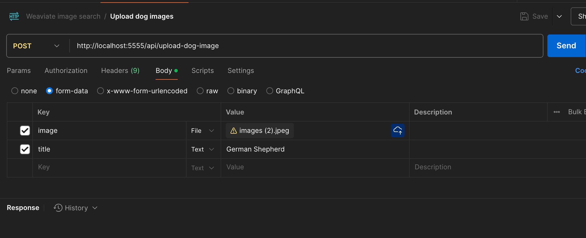

Trying `weaviate` with `img2vec-pytorch:resnet50`
---
Weaviate is an open source, AI-native vector database. [more info](https://weaviate.io/developers/weaviate)

# What is the goal?
In this demo, we demonstrate how to search for similar images using a reference image.
The images are added to the database by first converting them to base64 format and then processing them with img2vec-pytorch:resnet50 to map them into vectors, which are subsequently stored in Weaviate.
The vector data is indexed using [HNSW](https://weaviate.io/developers/academy/py/vector_index/hnsw), a feature provided by Weaviate.
`When a search query is performed, the reference image is vectorized and sent to Weaviate, which calculates cosine similarity to retrieve similar images from the database.`

# Setup
1. Clone the repository.
2. Run
   ```
      docker compose up
   ```
   or for detached mode
   ```
    docker compose up -d
   ```
3. Run
   ```
   yarn install
   ```
4. Run - to generate a collection in weaviate
   ```
   yarn cwc
   ```
5. Start the node server 
   ```
   yarn start
   ```
   
6. We have 2 apis
   - `http://localhost:5555/api/upload-dog-image`
   
   - `http://localhost:5555/api/get-similar-dog-image`
   
   
Setting up the FE
1. Run
   ```
   cd fe
   yarn install
   yarn dev     
   ```
   The backend url http://localhost:5555 is hardcoded in FE.


